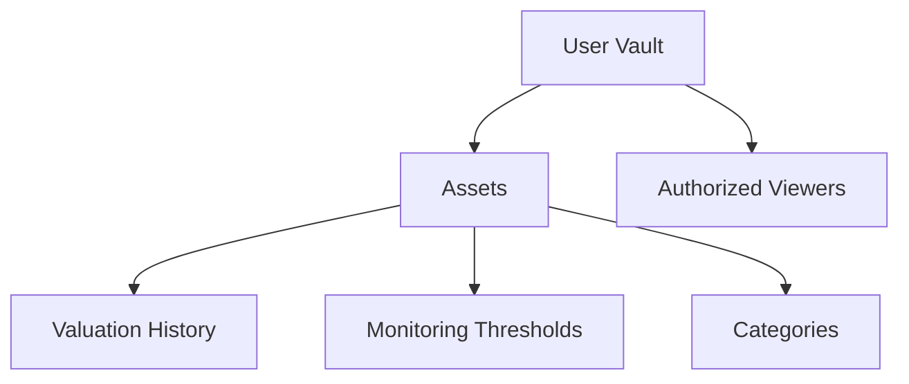

# Bulletproof Wrap

A versatile and secure digital asset wrapping mechanism on the Stacks blockchain, providing enhanced privacy, tracking, and controlled exposure for digital assets.

## Overview

Bulletproof Wrap enables advanced digital asset management through:
- Secure asset encapsulation and tracking
- Granular privacy and access controls
- Comprehensive valuation and monitoring
- Flexible permission management
- Immutable transaction and valuation records
- Performance and compliance tracking

## Architecture

The system is built around the concept of user vaults that contain digital assets. Each vault can hold multiple assets, with comprehensive tracking of valuations and customizable monitoring thresholds.



### Core Components:
- **Vaults**: Container for a user's portfolio with privacy settings
- **Assets**: Individual digital assets with metadata and current valuation
- **History**: Immutable record of asset valuations over time
- **Categories**: User-defined asset classifications
- **Thresholds**: Monitoring rules for asset values
- **Access Control**: Granular permissions for vault viewers

## Contract Documentation

### Main Contract: bulletproof-wrap.clar

The core contract implementing advanced digital asset wrapping and management capabilities.

#### Key Data Structures:
- `assets`: Stores asset details and current values
- `asset-history`: Tracks valuation history
- `user-categories`: Custom asset categorization
- `vaults`: User portfolio metadata
- `authorized-viewers`: Access control for third parties
- `monitoring-thresholds`: Value monitoring rules

## Getting Started

### Prerequisites
- Clarinet CLI
- Stacks wallet for deployment

### Basic Usage

1. Initialize a wrapped asset:
```clarity
(contract-call? .bulletproof-wrap initialize-wrap 
    "asset123" 
    "Bitcoin Investment" 
    "Digital Currency")
```

2. Register asset details:
```clarity
(contract-call? .bulletproof-wrap register-asset-details
    "asset123" 
    u1635724800 
    u50000 
    u55000 
    none)
```

3. Update asset value:
```clarity
(contract-call? .bulletproof-wrap update-asset-value "asset123" u60000)
```

## Function Reference

### Asset Management

#### register-asset
```clarity
(register-asset 
    (asset-id (string-ascii 36))
    (name (string-utf8 100))
    (category (string-ascii 50))
    (acquisition-date uint)
    (acquisition-cost uint)
    (current-value uint)
    (metadata (optional (string-utf8 1000)))
    (public-view bool))
```

#### update-asset-value
```clarity
(update-asset-value (asset-id (string-ascii 36)) (new-value uint))
```

### Access Control

#### authorize-viewer
```clarity
(authorize-viewer (viewer principal) (expiration (optional uint)))
```

#### revoke-viewer
```clarity
(revoke-viewer (viewer principal))
```

### Monitoring

#### set-threshold
```clarity
(set-threshold
    (asset-id (string-ascii 36))
    (threshold-id (string-ascii 36))
    (comparison (string-ascii 2))
    (value uint)
    (description (optional (string-utf8 200))))
```

## Development

### Local Testing

1. Initialize project:
```bash
clarinet new vaultpulse
```

2. Run tests:
```bash
clarinet test
```

3. Start local chain:
```bash
clarinet console
```

## Security Considerations

### Access Control
- All asset operations require owner authentication
- Viewer access can be time-limited
- Public visibility is configurable per asset

### Data Privacy
- Asset details are only visible to authorized parties
- Historical records are immutable once created
- Metadata can be optionally included or excluded

### Limitations
- No support for fractional ownership
- Asset values must be represented as integers
- Threshold monitoring requires external triggers

### Best Practices
- Regularly review authorized viewers
- Set expiration dates for temporary access
- Keep sensitive details in metadata optional
- Validate all inputs before transactions